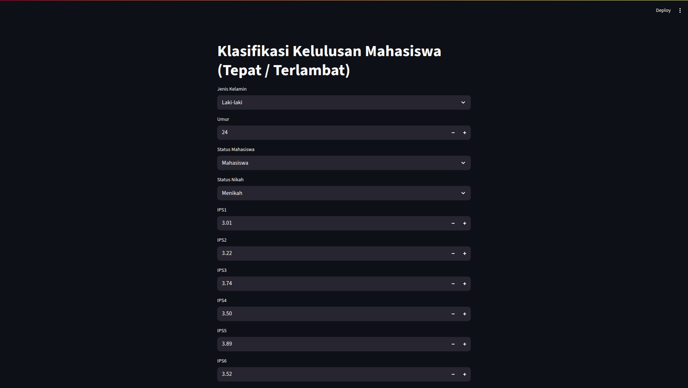

# 🎓 Student Graduation Prediction App

A simple web application built with **Streamlit** to predict the **graduation status of students**.  
This project was created as a **final assignment for a Data Mining course**.  
The application uses a **Decision Tree machine learning model** with the **C4.5 algorithm**.

---

## 📜 Description

The main goal of this application is to provide a tool for educational institutions to **identify students who have the potential to graduate on time or late**.  

By inputting relevant data such as semester GPAs, cumulative GPA, and other personal statuses, the application will provide a prediction result:  
> 🟢 **On Time** or 🔴 **Late**

The model used has been trained on a historical student graduation dataset to ensure prediction accuracy.

---

## 🖼️ App Preview

<p align="center" style="margin:0;padding:0;">
  
  
</p>

---

## ✨ Key Features

- 🧾 **Data Input Form** — An easy-to-use interface for entering student data.  
- ⚡ **Real-time Prediction** — Get prediction results instantly after submitting the data.  
- 📊 **Simple Visualization** — Displays prediction results clearly and understandably.  
- 🌳 **Decision Tree C4.5 Model** — Implementation of the C4.5 algorithm for interpretable classification.

---

## 📊 Dataset

The model was trained using a **student graduation dataset** containing several key attributes:

- **NAME** — Student's full name  
- **GENDER** — The gender of the student  
- **STUDENT STATUS** — Current status (e.g., Active, On Leave)  
- **AGE** — Age of the student  
- **MARITAL STATUS** — Marital status  
- **SEMESTER 1 GPA to SEMESTER 8 GPA** — Grade Point Average for each semester  
- **CUMULATIVE GPA** — Final cumulative GPA  
- **GRADUATION STATUS** — The target label indicating whether the student graduated *On Time* or *Late*


> ⚠️ Some attributes such as `NAME` might be excluded during model training.

---

## 🚀 Installation & How to Run

Follow these steps to run the application locally:

### 1️⃣ Clone the Repository
```bash
git clone https://github.com/Faridi17/Klasifikasi-Kelulusan.git
cd Klasifikasi-Kelulusan
```

### 2️⃣ Create and Activate a Virtual Environment
```bash
# For Windows
python -m venv venv
venv\Scripts\activate

# For macOS/Linux
python3 -m venv venv
source venv/bin/activate
```

### 3️⃣ Install Dependencies
Make sure you have a `requirements.txt` file, then run:
```bash
pip install -r requirements.txt
```

**Example requirements.txt:**
```
streamlit
pandas
scikit-learn
```

### 4️⃣ Run the Streamlit App
```bash
streamlit run app.py
```

Then open your browser and go to the URL shown in the terminal, usually:  
👉 [http://localhost:8501](http://localhost:8501)

---

## 🛠️ Technologies Used

- 🐍 **Python** — Main programming language  
- 🌐 **Streamlit** — Framework for building data web apps  
- 🧮 **Pandas** — Data manipulation and analysis  
- 🤖 **Scikit-learn** — Machine learning model implementation  

---

Made with ❤️ for the **Data Mining** course final project.